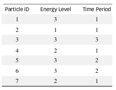
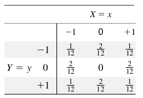
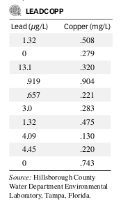
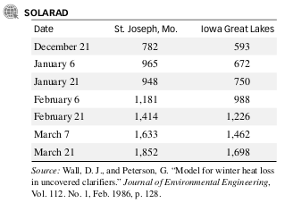

```{r setup, include=FALSE}
knitr::opts_chunk$set(echo = TRUE)
```

# Questions{}

## Q 1
`MS 5.54 - pg 215`
Phishing attacks to email accounts. Refer to the Chance
(Summer, 2007) article on phishing attacks at a company,
Exercise 2.24 (p. 38). Recall that phishing describes an attempt to extract personal/financial information through
fraudulent email. The company set up a publicized email
account—called a “fraud box”—which enabled employees to notify them if they suspected an email phishing attack. If there is minimal or no collaboration or collusion
from within the company, the interarrival times (i.e., the
time between successive email notifications, in seconds)
have an approximate exponential distribution with a mean
of 95 seconds.

  a. What is the probability of observing an interarrival
time of at least 2 minutes?
$$\int_{120}^{\infty}\frac{e^{-y/95}}{95} dy = -e^{-y/95}\Big|_{120}^{\infty} = e^{-\infty/95}+e^{-120/95}$$
```{r}
0+exp(-120/95)
```

  b. Data for a sample of 267 interarrival times are saved in
the PHISHING file. Do the data appear to follow an
exponential distribution with $\beta$ = 95?
```{r}
phishing <- read.csv("PHISHING.csv")
hist(phishing$INTTIME, xlab = "INTTIME", main = "Histogram or phishing")
```

<span style="color: red;">Yes, this distribution looks like a exponential distribution due to the shape.</span>

## Q 2
`MS 5.56 - pg 215`
Flood level analysis. Researchers have discovered that the
maximum flood level (in millions of cubic feet per sec-
ond) over a 4-year period for the Susquehanna River at
Harrisburg, Pennsylvania, follows approximately a gamma
distribution with $\alpha$ = 3 and $\beta$ = .07 (Journal of Quality
Technology, Jan. 1986).

  a. Find the mean and variance of the maximum flood
level over a 4-year period for the Susquehanna River.
```{r}
alpha = 3
beta = 0.07
mean = alpha*beta
var = alpha*(beta)^2
mean
var
```

  b. The researchers arrived at their conclusions about the
maximum flood level distribution by observing maxi-
mum flood levels over 4-year periods, beginning in 1890. Suppose that over the next 4-year period the
maximum flood level was observed to be .60 million
cubic feet per second. Would you expect to observe a
value this high from a gamma distribution with $\alpha$ = 3
and $\beta$ = .07? What can you infer about the maximum
flood level distribution for the 4-year period observed?
```{r}
# High end
mean+3*sqrt(var)
# Low end
mean-3*sqrt(var)
```

<span style="color: red;">This event could happen, but it would be extremely rare, definitely an outlier case on the high end.</span>

## Q 3
`MS 5.60 - pg 216`
Reaction to tear gas. The length of time Y (in minutes) re-
quired to generate a human reaction to tear gas formula A
has a gamma distribution with $\alpha$ = 2 and $\beta$ = 2. The dis-
tribution for formula B is also gamma, but with $\alpha$ = 1 and
$\beta$ = 4.

  a. Find the mean length of time required to generate a
human reaction to tear gas formula A. Find the mean
for formula B.
```{r}
alpha1 = 2
beta1 = 2
alpha2 = 1
beta2 = 4
mean1 = alpha1*beta1
mean2 = alpha2*beta2
mean1
mean2
```

  b. Find the variances for both distributions.
```{r}
var1 = alpha1*(beta1)^2
var2 = alpha2*(beta2)^2
var1
var2
```

  c. Which tear gas has a higher probability of generating a
human reaction in less than 1 minute? (Hint: You may
use the fact that
$\int ye^{-y/2} dy = -2ye^{-y/2} + \int 2e^{-y/2} dy$
This result is derived by integration by parts.)

For A:$$P(Y<1) = \int_{0}^{1} \frac{y^{2-1}e^{-y/2}}{2^2\Gamma(2)} dy = \int_{0}^{1}\frac{ye^{-y/2}}{4} dy$$
$$= \frac{1}{4}(-2ye^{-y/2})\Big|_{0}^{1} + \frac{1}{4}\int_{0}^{1}2e^{-y/2} dy$$
$$= \frac{1}{4}(-2e^{-1/2} + 2(0)e^0)+(-e^{-y/2})\Big|_{0}^{1} = -0.3033 -e^{-1/2}+e^0$$
$$-0.3033-0.6065+1=0.0902$$
For B:$$P(Y<1) = \int_{0}^{1} \frac{y^{1-1}e^{-y/4}}{4^1\Gamma(1)} dy = \int_{0}^{1}\frac{e^{-y/4}}{4} dy$$
$$= -e^{-y/4}\Big|_{0}^{1} = -e^{1/4} + e^0$$
$$= 1-0.7788 = 0.2212$$

<span style="color: red;">Because 0.2212 > 0.0902. This means that Formula B has a higher probability of generating a human reaction in less than 1 minute</span>

## Q 4
`MS 5.74 - pg 219`
Washing machine repair time. Based on extensive testing,
a manufacturer of washing machines believes that the distribution of the time Y (in years) until a major repair is required has a Weibull distribution with $\alpha$ = 2 and $\beta$ = 4.

  a. If the manufacturer guarantees all machines against a
major repair for 2 years, what proportion of all new
washers will have to be repaired under the guarantee?
$$F(y) = 1-e^{-y^\alpha/\beta}$$
```{r}
1-exp(-2^2/4)
```

  b. Find the mean and standard deviation of the length of
time until a major repair is required.
$$\mu = \beta^{1/\alpha}\Gamma(\frac{\alpha+1}{\alpha})$$
```{r}
mean = 4^{1/2}*gamma(3/2)
mean
```
$$\sigma^2=\beta^{2/\alpha}[\Gamma(\frac{\alpha+2}{\alpha})-\Gamma^2(\frac{\alpha+}{\alpha})]$$
```{r}
sigmaSquared = 4^(2/2)*((gamma((2+2)/2))-(gamma(3/2))^2)
sigma = sqrt(sigmaSquared)
sigma
```

  c. Find $P(\mu-2\sigma \leq Y \leq \mu + 2\sigma$.
```{r}
# High range
high = mean+2*sigma
high
# Low range
low = mean-2*sigma
low

(1-exp(-high^2/4))-(1-exp(-0^2/4))
```
  
  d. Is it likely that Y will exceed 6 years?
  
  <span style="color: red;">No the Probability is extremely small.</span>
```{r}
1-(1-exp(-6^2/4))
```
  
## Q 5
`MS 5.84 - pg 223`
Laser color printer repairs. The proportion Y of a data-
processing company’s yearly hardware repair budget allo-
cated to repair its laser color printer has an approximate
beta distribution with parameters $\alpha$ = 2 and $\beta$ = 9.

  a. Find the mean and variance of Y.
$$E(y)=\mu=\frac{\alpha}{\alpha+\beta}$$
```{r}
mean = (2/(2+9))
mean
```

$$\sigma^2=\frac{\alpha\beta}{(\alpha+\beta)^2(\alpha+\beta+1)}$$
```{r}
var = (2*9)/((2+9)^2*(2+9+1))
var
```

  b. Compute the probability that for any randomly selected
year, at least 40% of the hardware repair budget is used
to repair the laser color printer.
$$1-\frac{1}{B(2,9)}\int_{0}^{0.4} y(1-y)^8dy$$
```{r}
1-1/beta(2,9)*(-0.4*(1-0.4)^9/9-(((1-0.4)^10/(9*10))-(1)^10/(9*10)))
```

  c. What is the probability that at most 10% of the yearly
repair budget is used for the laser color printer?
$$\frac{1}{B(2,9)}\int_{0}^{0.1} y(1-y)^8dy$$
```{r}
1/beta(2,9)*(-0.1*(1-0.1)^9/9-(((1-0.1)^10/(9*10))-(1)^10/(9*10)))
```

## Q 6
`MS 5.114 - pg 232`
Lifelengths of memory chips. The lifelength Y (in years) of
a memory chip in a laptop computer is a Weibull random
variable with probability density
$$
f(y) = 
\begin{cases}
    \frac{1}{8}ye^{-y^2/16} \quad \text{if } 0\leq y < \infty\\
    0 \quad \quad \quad \quad \quad \quad \text{elsewhere}
\end{cases}
$$

  a. What are the values of $\alpha$ and $\beta$?
```{r}
alpha = 2
beta = 16
alpha
beta
```
  
  b. Compute the mean and variance of Y.
```{r}
mean = beta^{1/alpha}*gamma((alpha+1)/alpha)
var = beta^{2/alpha}*(gamma((alpha+2)/alpha)-(gamma((alpha+1)/alpha))^2)
mean
var
```
  
  c. Find the probability that a new memory chip will not
fail before 6 years.
```{r}
1-(1-exp(-(6)^alpha/beta))
```

## Q 7
`MS 6.2 - pg 239`
Tossing dice. Consider the experiment of tossing a pair of
dice. Let X be the outcome (i.e., the number of dots appearing face up) on the first die and let Y be the outcome
on the second die.

  a. Find the joint probability distribution p(x, y).
  $1 \leq X \leq 6$ and $1 \leq Y \leq 6$.
```{r}
(1/6)*(1/6)
```
<span style="color: red;">$$p(x, y) = \frac{1}{36}$$</span>
  
  b. Find the marginal probability distributions $p_1(x)$ and
$p_2(y)$.
$$p_1(x) = P(X=1) = p(1,1)+p(1,2)+p(1,3)+p(1,4)+p(1,5)+p(1,6)$$

$$\frac{1}{36}+\frac{1}{36}+\frac{1}{36}+\frac{1}{36}+\frac{1}{36}+\frac{1}{36}= \frac{6}{36} = \frac{1}{6}$$

$$p_2(x) = P(X=2) = p(2,1)+p(2,2)+p(2,3)+p(2,4)+p(2,5)+p(2,6)$$
$$\frac{1}{36}+\frac{1}{36}+\frac{1}{36}+\frac{1}{36}+\frac{1}{36}+\frac{1}{36}= \frac{6}{36} = \frac{1}{6}$$

  c. Find the conditional probability distributions $p_1(x | y)$
and $p_2(y | x)$.

When y = 1 $p_2(x | 1)=\frac{p(x,1)}{p_2(1)}$
$$p_1(1|1)=\frac{p(1,1)}{p_2(1)}=\frac{1/36}{1/6}=\frac{1}{6}$$
And so on for other $p_1(x | y)$ ... $$\frac{1}{6}$$
Meaning $$p_1(x|y) = \frac{1}{6}$$
Same probability for $p_2(y|x)$ because $1 \leq X \leq 6$ and $1 \leq Y \leq 6$ (Both sides are equal).

  d. Compare the probability distributions of parts b and c.
What phenomenon have you observed?

<span style="color: red;"> $p_1(x) = p_1(x|y)$ which implies that x and y are independent.</span>

## Q 8
`MS 6.4 - pg 240`
Modeling the behavior of granular media. Refer to the
Engineering Computations: International Journal for
Computer-Aided Engineering and Software (Vol. 30, No.
2, 2013) study of the properties of granular media (e.g.,
sand, rice, ball bearings, and flour), Exercise 3.62 (p. 120).
The study assumes there is a system of N non-interacting
granular particles, where the particles are grouped according to energy level, r. For this problem (as in Exercise
3.62), assume that N = 7 and r = 3, then consider the
scenario where there is one particle (of the total of 7 particles) at energy level 1, two particles at energy level 2, and
four particles at energy level 3. Another feature of the particles studied was the position in time where the particle
reached a certain entropy level during compression. All
particles reached the desired entropy level at one of three
time periods, 1, 2, or 3. Assume the 7 particles had the
characteristics shown in the table. Consider a randomly
selected particle and let X represent the energy level and Y
the time period associated with particle.
```{r, out.width = "400px"}

```

  a. Find the bivariate probability distribution, p(x, y).
  
  |   |   | 1 | 2 | 3 |
  |:-:|:-:|:-:|:-:|:-:|
  | x | 1 |1/7|2/7|1/7|
  | y | 2 | 0 | 0 |2/7|
  |   | 3 | 0 | 0 |1/7|
  
  b. Find the marginal distribution, $p_1(x)$.
  $$P(X=1)=p_1(1)=p(1,1)+p(1,2)+p(1,3)=\frac{1}{7}+0+0=\frac{1}{7}$$
  $$P(X=2)=p_1(2)=p(2,1)+p(2,2)+p(2,3)=\frac{2}{7}+0+0=\frac{2}{7}$$
  $$P(X=3)=p_1(3)=p(3,1)+p(3,2)+p(3,3)=\frac{1}{7}+\frac{2}{7}+\frac{1}{7}=\frac{4}{7}$$
  
  | x | 1 | 2 | 3 |
  |:-:|:-:|:-:|:-:|
  |$p_1(x)$|1/7|2/7|4/7|
  
  c. Find the marginal distribution, $p_2(x)$.
  $$P(Y=1)=p_2(1)=p(1,1)+p(2,1)+p(3,1)=\frac{1}{7}+\frac{2}{7}+\frac{1}{7}=\frac{4}{7}$$
    $$P(Y=2)=p_2(2)=p(1,2)+p(2,2)+p(3,2)=0+\frac{2}{7}+0=\frac{2}{7}$$
      $$P(Y=3)=p_2(3)=p(1,3)+p(2,3)+p(3,3)=0+0+\frac{1}{7}=\frac{1}{7}$$
      
  | y | 1 | 2 | 3 |
  |:-:|:-:|:-:|:-:|
  |$p_2(y)$|4/7|2/7|1/7|
  
  d. Find the conditional distribution, $p_2(y | x)$.
  
  When $X=1$, $p_2(y|1)=\frac{p(1,y)}{p_1(x)}$
  $$p_2(1|1) = \frac{p(1,1)}{p_1(1)} = \frac{1/7}{1/7}=1$$
  $$p_2(2|1) = \frac{p(1,2)}{p_1(1)} = \frac{0}{1/7}=0$$
  $$p_2(3|1) = \frac{p(3,1)}{p_1(1)} = \frac{0}{1/7}=0$$
  
  | y | 1 | 2 | 3 |
  |:-:|:-:|:-:|:-:|
  |$p_2(y|1)$| 1 | 0 | 0 |
  
  Same reasoning with when $X=2$ and $X=3$
  
  For $X=2$
  
  | y | 1 | 2 | 3 |
  |:-:|:-:|:-:|:-:|
  |$p_2(y|2)$| 1 | 0 | 0 |
  
  For $X=3$
  
  | y | 1 | 2 | 3 |
  |:-:|:-:|:-:|:-:|
  |$p_2(y|3)$| 1/4 | 2/4 | 1/4 |

## Q 9
`MS 6.12 - pg 244`
Distribution of low bids. The Department of Transportation
(DOT) monitors sealed bids for new road construction.
For new access roads in a certain state, let X = low bid
(thousands of dollars) and let Y = DOT estimate of fair
cost of building the road (thousands of dollars). The joint
probability density of X and Y is
$$f(x, y) = \frac{e^{-y/10}}{10y},\hspace{8 mm} 0 < y < x < 2y$$

  a. Find f(y), the marginal density function for Y. Do you
recognize this distribution?
$$f_2(y)=\int_{y}^{2y}f(x,y)dx=\int_{y}^{2y}\frac{e^{-y/10}}{10y}dx$$
$$=\frac{e^{-y/10}}{10y}x \Big|_{y}^{2y}=\frac{e^{-y/10}}{10y}(2y-y)=\frac{e^{-y/10}}{10}$$
  <span style="color: red;">This is an exponential distribution, $\beta = 10$.</span>

  b. What is the mean DOT estimate, E(Y)?
  
  <span style="color: red;">$E(Y)=\mu=\beta = 10$.</span>

## Q 10
`MS 6.14 - pg 245`
Servicing an automobile. The joint density of X, the total
time (in minutes) between an automobile’s arrival in the
service queue and its leaving the system after servicing,
and Y, the time (in minutes) the car waits in the queue be-
fore being serviced, is
$$f(x,y) =
\begin{cases}
    ce^{-x^2} \quad \text{if } 0\leq y < x; 0 \leq x < \infty\\
    0 \quad \quad \quad \text{elsewhere}
\end{cases}$$

a. Find the value of c that makes f(x, y) a probability density function.
$$\int_{-\infty}^{\infty}\int_{-\infty}^{\infty}f(x,y)dydx = 1$$
$$\int_{0}^{\infty}\int_{0}^{x}ce^{-x^2}dydx=\int_{0}^{\infty}ce^{-x^2}y\Big|_{0}^{x}dx = \int_{0}^{\infty}ce^{-x^2}x dx$$
$$\int_{0}^{\infty}cxe^{-x^2}dx=-\frac{cxe^{-x^2}}{2}\Big|_{0}^{\infty}=\frac{c}{2}=1=>c=2$$

b. Find the marginal density for X and show that
$$\int f_1(x)dx = 1$$
$$f_1(x)=\int_{-\infty}^{\infty}f(x,y)dy=\int_{0}^{x}2e^{-x^2}dy=2e^{-x^2}y\Big|_{0}^{x}=2xe^{-x^2}$$
$$\int_{-\infty}^{\infty}f_1(x)dx=\int_{0}^{\infty}2xe^{-x^2}dx=-e^{-x^2}\Big|_{0}^{\infty}=0+1=1$$

c. Show that the conditional density for Y given X is a uniform distribution over the interval $0 \leq Y \leq X$.
$$f_2(y|x)=\frac{f(x,y)}{f_1(x)}=\frac{2e^{-x^2}}{2xe^{-x^2}}=\frac{1}{x} \hspace{1cm} 0 \leq Y \leq X$$

## Q 11
`MS 6.51 - pg 253`
As an illustration of why the converse of Theorem 6.6 is not true, consider the joint distribution of two discrete random variables, X and Y, shown in the accompanying table.
Show that Cov(X, Y) = 0, but that X and Y are dependent.
```{r, out.width = "400px"}

```

$$Cov(X,Y)=E(XY) \hspace{1 cm} E(X)E(Y)$$
$$E(XY)=\sum_{x}\sum_{y}xyp(x,y)=(-1)(-1)(\frac{1}{12})+(-1)(0)(\frac{2}{12})+(-1)(1)(\frac{1}{12})$$
$$+(0)(-1)(\frac{2}{12}+(0)(0)(0)+(0)(1)(\frac{2}{12})+(1)(-1)(\frac{1}{12})+(1)(\frac{2}{12})(0)+(1)(1)(\frac{1}{12})$$
$$\frac{1}{12}+0-\frac{1}{12}+0+0+0-\frac{1}{12}+\frac{1}{12}=0$$
Then
$$P(X=1)=p_1(-1)=p(-1,-1)+p(-1,0)+p(-1,0)=\frac{1}{12}+\frac{2}{12}+\frac{1}{12}=\frac{4}{12}=\frac{1}{3}$$
$$P(X=0)=p_1(0)=p(0,-1)+p(0,0)+p(0,0)=\frac{2}{12}+0+\frac{2}{12}=\frac{4}{12}=\frac{1}{3}$$
$$P(X=1)=p_1(1)=p(1,-1)+p(1,0)+p(1,0)=\frac{1}{12}+\frac{2}{12}+\frac{1}{12}=\frac{4}{12}=\frac{1}{3}$$
$$E(X)=\sum_{x}xp_1(x)=(-1)(\frac{1}{3})+(0)(\frac{1}{3})+(1)(\frac{1}{3})=0$$
Same thing for $(Y=-1)$, $(Y=0)$, $(Y=1)$.

$$E(Y)=\sum_{x}yp_1(-1,1)=(-1)(\frac{1}{3})+(0)(\frac{1}{3})+(1)(\frac{1}{3})$$

$$Cov(X,Y)=E(XY)-E(X)E(Y)=0-0(0)=0$$
$$p(x,y)=p_1(x)p_2(y)=> \frac{1}{12}\neq(\frac{1}{3})(\frac{1}{3})$$
<span style="color: red;">Thus, $X$ and $Y$ are not independent even though $Cov(X,Y) = 0$.</span>


## Q 12
`MS 6.74 - pg 269`
Uranium in the Earth’s crust. Refer to the American Mineralogist (October 2009) study of the evolution of uranium minerals in the Earth’s crust, Exercise 5.17 (p. 199).
Recall that researchers estimate that the trace amount of
uranium Y in reservoirs follows a uniform distribution
ranging between 1 and 3 parts per million. In a random
sample of n = 60 reservoirs, let $\overline{Y}$ represent the sample
mean amount of uranium.

  a. Find $E(\overline{Y})$ and interpret its value.
  $$E(\bar{Y})=E(\frac{\sum_{i=1}^{60} Y_i}{n})=\frac{1}{n}E(\sum_{i=1}^{60}Y_i)=\frac{1}{60}[60(2)]=2$$
  
  b. Find Var $\overline{Y}$.
  $$\sigma^2_{\bar{Y}}=V(\bar{Y})=V(\frac{\sum_{i=1}^{60} Y_i}{n})=(\frac{1}{n})^2V({\sum_{i=1}^{60} Y_i})$$
```{r}
sigmaSquared = (1/60^2)*(60/3)
sigmaSquared
```
  
  c. Describe the shape of the sampling distribution of $\overline{Y}$.
  <span style="color: red;">By the central Limit Theorem, the sampling distribution of $\bar{Y}$ is approximately normal.</span>
  
  d. Find the probability that $\overline{Y}$ is between 1.5 ppm and
2.5 ppm.
```{r}
sigma = sqrt(sigmaSquared)
sigma
```
$$P(1.5 \leq \bar{Y} \leq 2.5)=P(\frac{1.5-2}{0.0745} \leq Z \leq \frac{2.5-2}{0.0745})=P(-6.71 \leq Z \leq 6.71)$$
$$=P(0 \leq Z \leq 6.71)+P(0 \leq Z \leq 6.71) \approx 0.5+0.5=1$$

  e. Find the probability that $\overline{Y}$ exceeds 2.2 ppm.
  $$P(Y \leq 2.2)=P(Z \geq \frac{2.2-2}{0.0745})=P(Z\geq2.68)$$
  $$=0.5-P(0 \leq Z \leq 2.68)=0.5+0.4963=0.9963$$

## Q 13
`MS 6.90 - pg 273`
Mercury contamination of swordfish. Consumer Reports
found widespread contamination of seafood in New York
and Chicago supermarkets. For example, 40% of the
swordfish pieces available for sale have a level of mercury
above the Food and Drug Administration (FDA) limit.
Consider a random sample of 20 swordfish pieces from
New York and Chicago supermarkets.

  a. Use the normal approximation to the binomial to calculate
the probability that fewer than 2 of the 20 swordfish pieces
have mercury levels exceeding the FDA limit.
$$P(Y<2)=P(Z < \frac{1.5-8}{2.1909})=P(Z<2.97)=0.5-P(-2.97 < Z <0)=0.5 -0.4985=0.0015$$

  b. Use the normal approximation to the binomial to calculate the probability that more than half of the 20 swordfish pieces have mercury levels exceeding the FDA limit.
  $$P(Y>10)=P(Z>\frac{10.5-8}{2.1909})=P(Z>1.14)=0.5-P(0<Z<1.14)=0.5-0.3729 = 0.1271$$

  c. Use the binomial tables to calculate the exact probabilities in parts a and b. Does the normal distribution provide a good approximation to the binomial distribution?
  $$P(Y<2)=P(Y<1)=0.0005$$
  $$P(Y>10)-1-P(Y \leq 10)-1-0.8725-0.1275$$
  <span style="color: red;">The normal approximation provides a good estimate of the binomial distribution.</span>

## Q 14 NOT DONE
`MS 7.108 - pg 362`
Lead and copper in drinking water. Periodically, the
Hillsborough County (Florida) Water Department tests
the drinking water of homeowners for contaminants such
as lead and copper. The lead and copper levels in water
specimens collected for a sample of 10 residents of the
Crystal Lake Manors subdivision are shown next.
```{r, out.width = "400px"}

```

  a. Construct a 99% confidence interval for the mean
lead level in water specimens from Crystal Lake
Manors.
<span style="color: red;">(-1.15, 6.92)</span>

  b. Construct a 99% confidence interval for the mean cop-
per level in water specimens from Crystal Lake
Manors.
<span style="color: red;">(0.1519, 0.6647)</span>

  c. Interpret the intervals, parts a and b, in the words of
the problem.
<span style="color: red;"></span>

  d. Discuss the meaning of the phrase, “99% confident.”

## Q 15 NOT DONE
`MS 7.114 - pg 364`
Solar irradiation study. The Journal of Environmental
Engineering (Feb. 1986) reported on a heat transfer
model designed to predict winter heat loss in wastewater
treatment clarifiers. The analysis involved a comparison of
clear-sky solar irradiation for horizontal surfaces at different sites in the Midwest. The day-long solar irradiation levels (in BTU/sq. ft.) at two midwestern locations
of different latitudes (St. Joseph, Missouri, and Iowa
Great Lakes) were recorded on each of seven clear-sky
winter days. The data are given in the table. Find a 95%
confidence interval for the mean difference between the
day-long clear-sky solar irradiation levels at the two
sites. Interpret the results.
```{r, out.width = "400px"}

```

## Q 16 NOT DONE
`MS 7.116 - pg 364`
Diazinon residue in orchards. Pesticides applied to an extensively grown crop can result in inadvertent areawide air contamination. Environmental Science & Technology
(Oct. 1993) reported on air deposition residues of the insecticide diazinon used on dormant orchards in the San
Joaquin Valley, California. Ambient air samples were collected and analyzed at an orchard site for each of 11 days
during the most intensive period of spraying. The levels
of diazinon residue (in mg/m3) during the day and at night
are recorded in the table. The researchers want to know
whether the mean diazinon residue levels differ from day
to night.
```{r, out.width = "400px"}

```

  a. Analyze the data using a 90% confidence interval.
  
  b. What assumptions are necessary for the validity of the
interval estimation procedure of part a?

  c. Use the interval, part a, to answer the researchers’
question.
