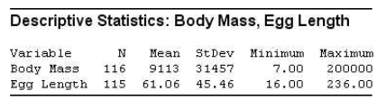
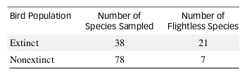
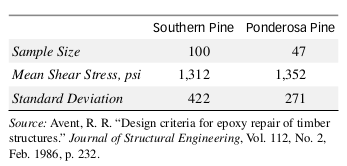
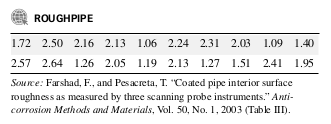
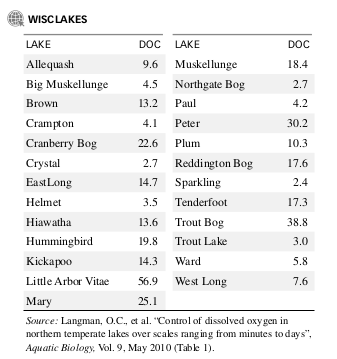
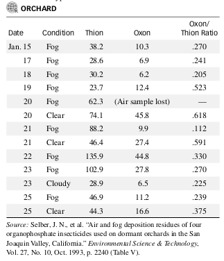
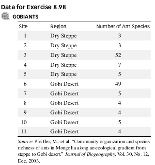
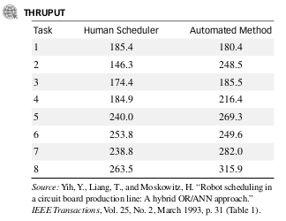

```{r setup, include=FALSE}
knitr::opts_chunk$set(echo = TRUE)
```

# Questions{}

## Q 1 NOT DONE
`MS 7.118 - pg 364`
Extinct New Zealand birds. Refer to the Evolutionary
Ecology Research (July 2003) study of the New Zealand
bird population prior to European contact, Exercise 1.12
(p. 6). Two quantitative variables measured for each of the
116 bird species were body mass (grams) and egg length
(millimeters). Descriptive statistics for these variables are
shown on the MINITAB printout below.
```{r, out.width = "400px"}

```

a. Use a random number generator to select a random
sample of 35 species from the NZBIRDS file.

b. Calculate the mean and standard deviation for the 35
sampled values of body mass. Then, use this information to construct a 95% confidence interval for the
mean body mass of all 116 bird species.

c. Give a practical interpretation of the interval, part b.

d. Check to see if the true mean, m (shown on the MINITAB
printout), is included in the confidence interval, part b.
Explain why the interval is very likely to contain m.

e. Repeat parts b–d for the 35 sampled values of egg length.

  f. Ecologists also want to compare the proportions of
flightless birds for two New Zealand bird populations—those that are extinct and those that are not extinct. Use the sample information in the table below to
form a 95% confidence interval for the difference between the proportion of flightless birds for extinct and nonextinct species.

  g. The ecologists are investigating the theory that the proportion of flightless birds will be greater for extinct
species than for nonextinct species. Does the confidence interval, part f, support this theory? Explain.

```{r, out.width = "400px"}

```

## Q 2 NOT DONE
`MS 7.120 - pg 365`
Strength of epoxy-repaired joints. The methodology for
conducting a stress analysis of newly designed timber
structures is well known. However, few data are available
on the actual or allowable stress for repairing damaged
structures. Consequently, design engineers often propose a
repair scheme (e.g., gluing) without any knowledge of
its structural effectiveness. To partially fill this void, a
stress analysis was conducted on epoxy-repaired truss
joints (Journal of Structural Engineering, Feb. 1986).
Tests were conducted on epoxy-bonded truss joints made
of various species of wood to determine actual glue-line
shear stress recorded in pounds per square inch (psi).
Summary information for independent random samples of
southern pine and ponderosa pine truss joints is given in
the accompanying table.
```{r, out.width = "400px"}

```

  a. Estimate the difference between the mean shear
strengths of epoxy-repaired truss joints for the two
species of wood with a 90% confidence interval.

  b. Construct a 90% confidence interval for the ratio of the
shear stress variances of epoxy-repaired truss joints for
the two species of wood. Based on this interval, is there
evidence to indicate that the two shear stress variances
differ? Explain.

## Q 3 NOT DONE
`MS 7.128 - pg 367`
Suppose y is a random sample of size n = 1 from a normal distribution with mean 0 and unknown variance $\sigma^2$.

  a. Show that $y^2$/$\sigma^2$ has a chi-square distribution with 1
degree of freedom. (Hint: The result follows directly
from Theorem 6.11.)

  b. Derive a 95% confidence interval for $\sigma^2$ using $y^2$/$\sigma^2$
as a pivotal statistic.

## Q 4 NOT DONE
`MS 8.24 - pg 390`
Surface roughness of pipe. Refer to the Anti-corrosion
Methods and Materials (Vol. 50, 2003) study of the surface roughness of coated interior pipe used in oil fields,
Exercise 7.26 (p. 311). The data (in micrometers) for
20 sampled pipe sections are reproduced in the table on
p. 391.

  a. Give the null and alternative hypotheses for testing
whether the mean surface roughness of coated interior
pipe, $\mu$, differs from 2 micrometers.

  b. The results of the test, part a, are shown in the
MINITAB printout at the bottom of the page. Locate
the test statistic and p-value on the printout.

```{r, out.width = "400px"}

```

  c. Give the rejection region for the hypothesis test, using
$\alpha$ = .05.

  d. State the appropriate conclusion for the hypothesis test.
  
  e. In Exercise 7.26 you found a 95% confidence interval
for $\mu$. Explain why the confidence interval and test statistic lead to the same conclusion about $\mu$.

## Q 5 NOT DONE
`MS 8.28 - pg 392`
Dissolved organic compound in lakes. The level of dissolved oxygen in the surface water of a lake is vital to
maintaining the lake’s ecosystem. Environmentalists from
the University of Wisconsin monitored the dissolved oxygen levels over time for a sample of 25 lakes in the state
(Aquatic Biology, May 2010). To ensure a representative
sample, the environmentalists focused on several lake
characteristics, including dissolved organic compound
(DOC). The DOC data (measured in grams per cubic-meters) for the 25 lakes are listed in the accompanying table.
The population of Wisconsin lakes has a mean DOC value
of 15 grams/$m^3$.

  a. Use a hypothesis test (at $\alpha$ = .10) to make an inference
about whether the sample is representative of all Wisconsin lakes for the characteristic, dissolved organic
compound.

  b. What is the likelihood that the test, part a, will detect
a mean that differs from 15 grams/$m^3$ if, in fact, $\mu_a$ =
14 grams/$m^3$?

```{r, out.width = "400px"}

```

## Q 6 NOT DONE
`MS 8.44 - pg 401`
Insecticides used in orchards. Environmental Science &
Technology (Oct. 1993) reported on a study of insecticides
used on dormant orchards in the San Joaquin Valley,
California. Ambient air samples were collected and analyzed
daily at an orchard site during the most intensive period
of spraying. The thion and oxon levels (in ng/$m^2$) in the
air samples are recorded in the table, as well as the
oxon/thion ratios. Compare the mean oxon/thion ratios of
foggy and clear/cloudy conditions at the orchard using a
test of hypothesis. Use $\alpha$ = .05.

```{r, out.width = "400px"}

```

## Q 7 NOT DONE
`MS 8.84 - pg 425 – This refers to 8.39 NOT 8.33!`
Cooling method for gas turbines. Refer to the Journal of
Engineering for Gas Turbines and Power (Jan. 2005)
study of gas turbines augmented with high-pressure inlet
fogging, Exercise 8.39 (p. 399). Heat rate data (kilojoules
per kilowatt per hour) for each of three types of gas turbines (advanced, aeroderivative, traditional) are saved in
the GASTURBINE file. In order to compare the mean
heat rates of two types of gas turbines, you assumed that
the heat rate variances were equal.

  a. Conduct a test (at $\alpha$ = .05) for equality of heat rate
variances for traditional and aeroderivative augmented gas turbines. Use the result to make a statement about
the validity of the inference derived in Exercise 8.33 a.

  b. Conduct a test (at $\alpha$ = .05) for equality of heat rate
variances for advanced and aeroderivative augmented
gas turbines. Use the result to make a statement about
the validity of the inference derived in Exercise 8.39 b.

## Q 8 NOT DONE
`MS 8.99 - pg 438`
```{r, out.width = "400px"}

```

Mongolian desert ants (continued). Refer to the Journal of
Biogeography (Dec. 2003) study of ants in Mongolia (Central Asia), Exercise 8.98, where you compared the mean
number of ants at two desert sites. Since the sample sizes
were small, the variances of the populations at the two sites
must be equal in order for the inference to be valid.

a. Set up $H_0$ and $H_a$ for determining whether the variances
are the same.

b. Use the data in the GOBIANTS file to find the test statistic for the test.

c. Give the rejection region for the test if $\alpha$ = .05.

d. Find the approximate p-value of the test.

e. Make the appropriate conclusion in the words of the
problem.

f. What conditions are required for the test results to be
valid?

## Q 9 NOT DONE
`MS 8.104 - pg 439`
Real-time scheduling with robots. Researchers at Purdue
University compared human real-time scheduling in a
processing environment to an automated approach that
utilizes computerized robots and sensing devices (IEEE
Transactions, Mar. 1993). The experiment consisted of
eight simulated scheduling problems. Each task was performed by a human scheduler and by the automated system. Performance was measured by the throughput rate,
defined as the number of good jobs produced weighted by
product quality. The resulting throughput rates are shown
in the accompanying table. Analyze the data using a test
of hypothesis.
```{r, out.width = "400px"}

```

## Q 10 NOT DONE
`Look at the ass4.pdf`
