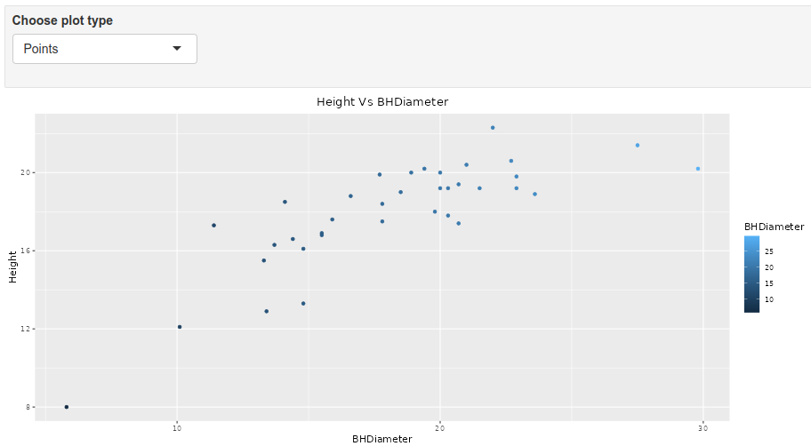
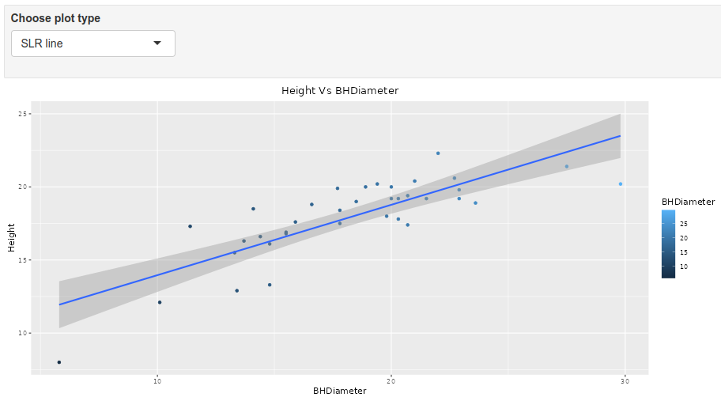
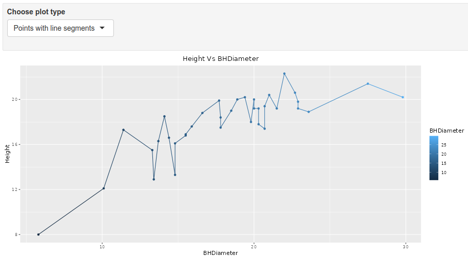

```{r setup, include=FALSE}
knitr::opts_chunk$set(echo = TRUE)
```

# Tasks

## Task 1

WD

```{r}
getwd()
```

## Task 2

```{r}
spruce.df = read.csv("SPRUCE.csv")
head(spruce.df)
```

## Task 3

  1. Make a scatter plot of the data (y axis will be the Height).
  
```{r}
plot(spruce.df$Height~spruce.df$BHDiameter, bg="Blue",pch=21, xlim = c(0, 1.1*max(spruce.df$BHDiameter)), xlab = "Breast Height Diameter in cm", ylim = c(0, 1.1*max(spruce.df$Height)), ylab = "Height of Spruce Tree", cex = 1.2, main = "Plot of Height vs Breast Height Diameter")
```

 2. Does there appear to be a straight line relationship? `No, a curve would be more appropriate.`
 3. Load the library s20x and make a lowess smoother scatter plot using trendscatter() (try a few values of f, f=0.5,0.6,0.7) record all three plots, use layout().

```{r}
library(s20x)
layout(matrix(1:3,nr=1,nc=3,byrow=TRUE))
trendscatter(Height~BHDiameter,f=0.5, data=spruce.df, main = "f = 0.5")
trendscatter(Height~BHDiameter,f=0.6, data=spruce.df, main = "f = 0.6")
trendscatter(Height~BHDiameter,f=0.7, data=spruce.df, main = "f = 0.7")
```

 4. We will assume (this may in fact be a bad assumption) a straight line relationship, use lm and make a linear model object, call it spruce.lm 

```{r}
spruce.lm = with(spruce.df, lm(Height~BHDiameter))
```

 5. Make a new scatter plot and add the least squares regression line to the points - abline(spruce.lm) – record the plot.
 
```{r}
layout(1)
plot(spruce.df$Height~spruce.df$BHDiameter, bg="Blue",pch=21, xlim = c(0, 1.1*max(spruce.df$BHDiameter)), xlab = "Breast Height Diameter in cm", ylim = c(0, 1.1*max(spruce.df$Height)), ylab = "Height of Spruce Tree", cex = 1.2, main = "Plot of Height vs Breast Height Diameter")
abline(spruce.lm)
```

 6. Comment on the graph, is a straight line appropriate? Consider the smoother curve also. `Yes`

## Task 4

 1. Divide the graphical interface into 4 equal areas, use layout.show(4) and record the picture.
 
```{r}
# First Square Plot
layout(matrix(1:4,nr=2,nc=2,byrow=TRUE))
layout.show(4)
plot(spruce.df$Height~spruce.df$BHDiameter, bg="Blue",pch=21, xlim = c(0, 1.1*max(spruce.df$BHDiameter)), xlab = "Breast Height Diameter in cm", ylim = c(0, 1.1*max(spruce.df$Height)), ylab = "Height of Spruce Tree", cex = 1.2, main = "Fitted Line Plot")
abline(spruce.lm)

# Second Square Plot
plot(spruce.df$Height~spruce.df$BHDiameter, bg="Blue",pch=21, xlim = c(0, 1.1*max(spruce.df$BHDiameter)), xlab = "Breast Height Diameter in cm", ylim = c(0, 1.1*max(spruce.df$Height)), ylab = "Height of Spruce Tree", cex = 1.2, main = "RSS Plot")
yhat = fitted(spruce.lm)
with(spruce.df,{
segments(BHDiameter,Height,BHDiameter,yhat)
})
abline(spruce.lm)

# Third Square Plot
plot(spruce.df$Height~spruce.df$BHDiameter, bg="Blue",pch=21, xlim = c(0, 1.1*max(spruce.df$BHDiameter)), xlab = "Breast Height Diameter in cm", ylim = c(0, 1.1*max(spruce.df$Height)), ylab = "Height of Spruce Tree", cex = 1.2, main = "MSS Plot")
with(spruce.df, segments(BHDiameter,mean(Height),BHDiameter,yhat,col="Red"))
abline(spruce.lm)
with(spruce.df,abline(h=mean(Height)))

# Fourth Square Plot
plot(spruce.df$Height~spruce.df$BHDiameter, bg="Blue",pch=21, xlim = c(0, 1.1*max(spruce.df$BHDiameter)), xlab = "Breast Height Diameter in cm", ylim = c(0, 1.1*max(spruce.df$Height)), ylab = "Height of Spruce Tree", cex = 1.2, main = "TSS Plot")
with(spruce.df,abline(h=mean(Height)))
with(spruce.df, segments(BHDiameter,Height,BHDiameter,mean(Height),col="Green"))
```

 2. Calculate TSS, MSS and RSS

```{r}
RSS = with(spruce.df,sum((Height-yhat)^2))
RSS
MSS = with(spruce.df,sum((yhat-mean(Height))^2))
MSS
TSS = with(spruce.df,sum((Height-mean(Height))^2))
TSS
```
 
 3. Calculate $MSS/TSS$, and interpret it! `The ratio of how well BHDiameter predicts Height or the calculation of R^2.`
 
```{r}
MSS/TSS
```
 
 4. Does TSS = MSS + RSS? `YES`
```{r}
MSS + RSS
TSS
```

## Task 5

 1. Summarize spruce.lm paste it here.
 
```{r}
summary(spruce.lm)
```
 
 2. What is the value of the slope? `0.48147`
 3. What is the value of the intercept? `9.14684`
 4. Write down the equation of the fitted line. `Height = 9.1468 + (0.48147)BHDiameter`
 5. Predict the Height of spruce when the Diameter is 15, 18 and 20cm (use predict())
 
```{r}
predict(spruce.lm, data.frame(BHDiameter = c(15, 18, 20)))
```
 
## Task 6

 1. Use appropriate code using the ggplot2 package to make a plot of Height Vs Diameter with shading lines and legend
 
```{r}
library(ggplot2)
g=ggplot(spruce.df, aes(x=BHDiameter,y=Height, colour=BHDiameter))
g=g+geom_point() + geom_line()+ geom_smooth(method="lm")
g+ggtitle("Height Vs BHDiameter") + theme(plot.title = element_text(hjust = 0.5))
```
 
## Task 7

<center>
{ width=70% }
</center>

<center>
{ width=70% }
</center>

<center>
{ width=70% }
</center>
