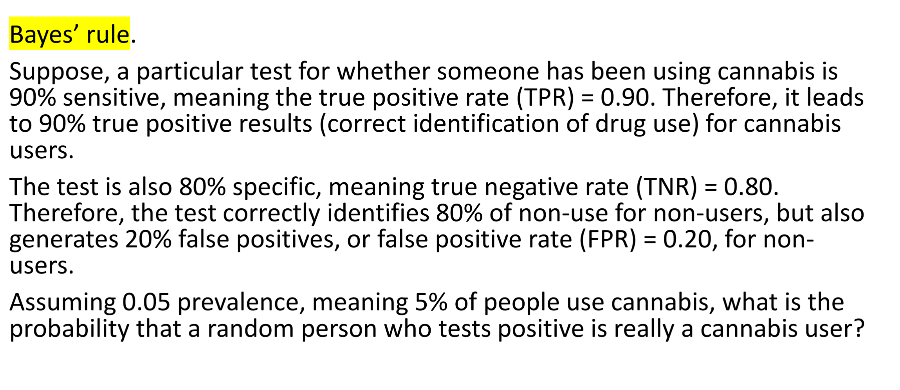
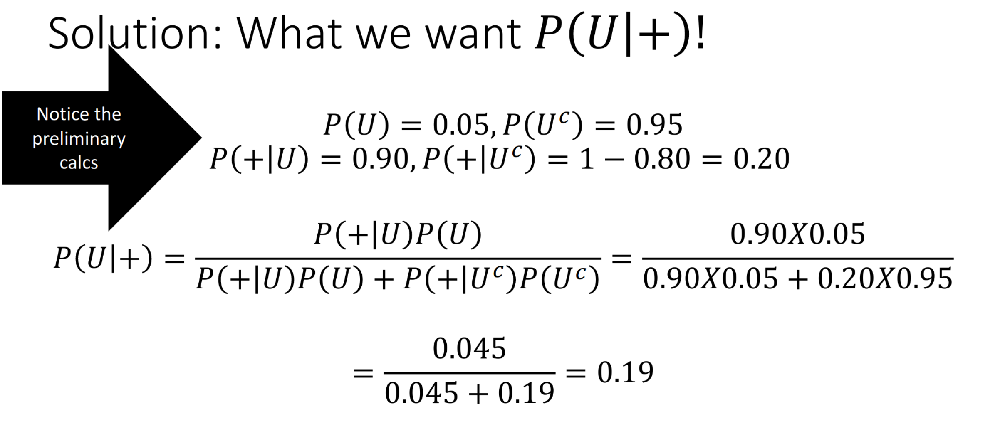
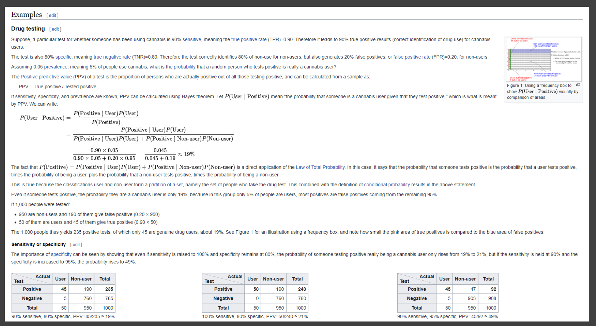

```{r setup, include=FALSE}
knitr::opts_chunk$set(echo = TRUE)
```

# Exam 1 Overview (Requirements)

## Read in data & make table

### Read in Data
```{r}
dird="~/Desktop/MainFolder/OuClasses/Spring 2023/Applied Statistical Methods/FALL224753wise0046/CourseData/Data-for-the-course/K25936_Downloads/Excel/"
library(readxl)
files = list.files(dird)
myconvert = function(xl) {
  if(stringr::str_ends(xl, "XLS") | stringr::str_ends(xl, "xls")){
    v=try(readxl::read_xls(paste0(dird, xl)), silent = TRUE)
  }
  else{
    v = NA
  }
  v
}
# eggs <- myconvert("EGGS.XLS")
# head(eggs)

ddt <- read.csv("DDT-1.csv")
head(ddt)
```

### Data Wrangling
```{r}
ddt[ddt$SPECIES == "CCATFISH" & ddt$WEIGHT > 1700,]
nrow(ddt[ddt$SPECIES == "CCATFISH" & ddt$WEIGHT > 1700,])
```

### Make Table
```{r}
tab <- table(ddt$RIVER,ddt$SPECIES)
addmargins(tab)
tab

mtbe = myconvert("MTBE.XLS")
tt <- table(mtbe$WellClass, mtbe$`MTBE-Detect`)
tt
att <- addmargins(tt)
att
```

### Add new variable to table
```{r}
ddtnew <- within(ddt , Z <- (ddt$DDT-mean(ddt$DDT))/sd(ddt$DDT))
head(ddtnew)
```


## Find AND, OR, & GIVEN probabilities from table
```{r}
# Below Limit AND Private
81/223

# Below Limit OR Private
(72+81+22)/223

# Below Limit GIVEN Private
81/103
```

## Solve a Bayes testing type problem
```{r}



```

## Calculate z-score & use Empirical/Chebyshev rules

### z-score
```{r}
# z-score calculation
z1 = (ddt$LENGTH - mean(ddt$LENGTH)) / sd(ddt$LENGTH)
z2 = (ddt$WEIGHT - mean(ddt$WEIGHT)) / sd(ddt$WEIGHT)
head(z1)
head(z2)
```

### Finding outliers
#### Percent of data within 2 Standard deviations from the mean
```{r}
exacttwo = length(ddt$LENGTH[abs(z1) < 2]) / length(ddt$LENGTH)
exacttwo
```

### Empirical Rule
#### If the distribution is mound shape and centered
#### Then the ratio is 68-95-99.7 for standard deviation 1-2-3.

### Chebyshev's Rule
```{r}
# Chebyshev’s theorem (k = number of standard deviations)
k = 1
cheb = 1 - 1 / (k ^ 2)
cheb
k = 2
cheb = 1 - 1 / (k ^ 2)
cheb
k = 3
cheb = 1 - 1 / (k ^ 2)
cheb
```

## Find c in density problem
Let c be a constant and consider the density function for
the random variable Y:
$$
f(y) = 
\begin{cases}
    c(2-y) \quad \text{if } 0\leq y \leq 1\\
    0 \quad \quad \quad \quad \text{elsewhere}
\end{cases}
$$
Find the value of c.
$$c\int_{0}^{1} (2-y) \,dy = 1$$
$$c (2y-\frac{y^2}{2}) \Big|_{0}^{1} = 1$$
$$c (2*1-\frac{1^2}{2})-(2*0-\frac{0^2}{2}) = 1$$
$$c(2-\frac{1}{2}) = 1$$
$$c = 1 * \frac{2}{3}$$
```{r}
2/3
```
Integral calculator: https://www.integral-calculator.com/

## Find probabilities

$X$~$Bin(n=10, p=1/3)$
$Y$~$Normal(\mu=5, \sigma=2)$

### Discrete probabilities
#### Endpoints matter
$P(X \ge 6)$
```{r}
1-pbinom(5, 10, 1/3)
```
$P(X < 8)$
```{r}
pbinom(7, 10, 1/3)
```
$P(2 \leq X \leq 7)$
```{r}
pbinom(7, 10, 1/3)-pbinom(1,10,1/3)
```

### Continuious probabilities
#### Endpoints don't matter
$P(Y \ge 6)$
```{r}
1-pnorm(6, 5, 2)
```
$P(Y < 8)$
```{r}
pnorm(8, 5, 2)
```
$P(2 \leq Y \leq 7)$
```{r}
pnorm(7, 5, 2)-pnorm(2, 5, 2)
```

## Use MGF's

### Mean
$$E(y) = \mu$$
$$
f(y) = 
\begin{cases}
    \frac{3}{500}(25-y^2) \quad \text{if } -5\leq y \leq 5\\
    0 \quad \quad \quad \quad \quad \quad \text{elsewhere}
\end{cases}
$$
$$f(y) = \frac{3}{500} (25-y^2) \,dy$$
$$E(y) = \mu = \frac{3}{500} \int_{-5}^{5} (25y-y^3) \,dy$$
Then solve MEAN
```{r}
3/500*((25*(5)^2/2-(5)^4/4)-(25*(-5)^2/2-(-5)^4/4))
```

### Variance
$$E(y^2) = \frac{3}{500} \int_{-5}^{5} (25y^2-y^4)$$
Then solve E(y^2)
```{r}
(3/500*((25*(5)^3/3-(5)^5/5)-(25*(-5)^3/3-(-5)^5/5)))
```

Solve for V(y)
```{r}
(3/500*((25*(5)^3/3-(5)^5/5)-(25*(-5)^3/3-(-5)^5/5)))-(3/500*((25*(5)^2/2-(5)^4/4)-(25*(-5)^2/2-(-5)^4/4)))^2
```

Note:
$$V(y) = \sigma^2 = E(y^2)-\mu^2 = 5 - 0^2 = 5$$
$$V(Y) = V(3X+4) =E ((3X+4-(3μ+4))^2)$$
$$= E((3X-3μ)^2)=E(9(X-μ)^2)$$
$$= 9*E((X-μ)^2)=9*V(X)=18$$
